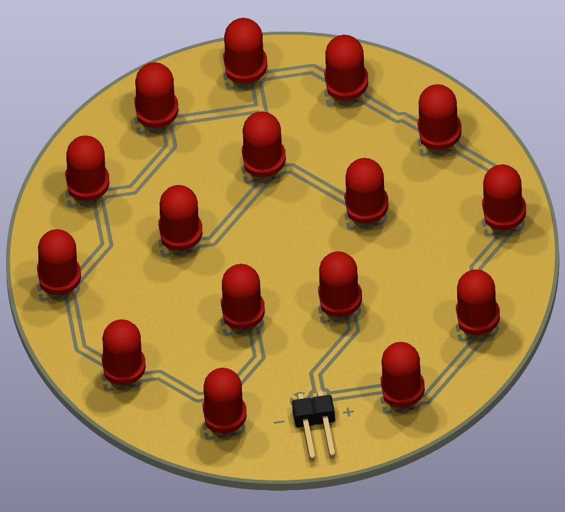

# LED-Einheit / Lampenkopf
## Bauteilliste

| Bauteil              | RS-Bestellnummer | Stück |
|----------------------|------------------|-------|
| LED                  | [254-5723](https://at.rs-online.com/web/p/leds/2545723)         | 16    |
| Stifleiste gewinkelt | –                | 1     |
| Widerstand 4,7 Ohm   | –                | 1     |

Project download: 
[⬇️ Schaltplan herunterladen](https://github.com/michaelwittner/2526_5AHEL_LA_Schreibtischlampe/blob/master/02_LED-Einheit/Prints/led_print_eckig.zip)

### Schaltung:

Widerstand R1: 4,7 Ohm

## Länglicher Kopf mit Aluminium U Profil
### Printplan:

### 3D-Ansicht:

## Runder Kopf
### Printplan:

### 3D-Ansicht

