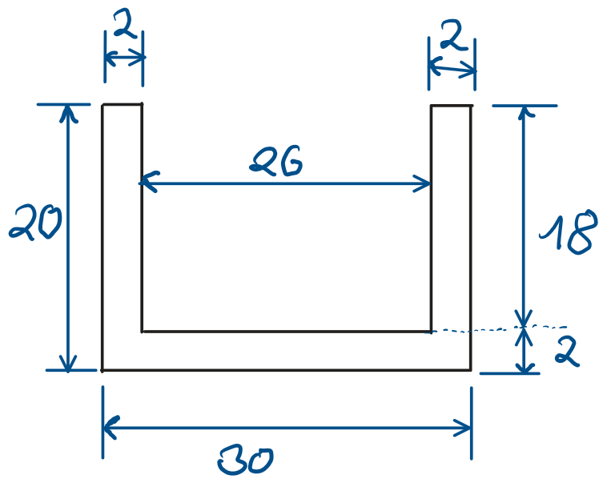

# Mechanischer Aufbau

## Mechanische  Aussenteile
Bodenplatte 3D druck:\

#### IKEA-Schüssel für Standfuß:
https://www.ikea.com/at/de/search/?q=30081467

#### Schwanenhals:
Silber:\
https://www.pollin.at/p/schwanenhals-350-mm-in-stahl-chrom-ausfuehrung-gewinde-m8x0-75-630875 

#### Kopf:
Variante1 (Quader):\
Aluminium U-Profil mit Tiefe 143mm und folgenden Abmaßen:

Vordere Kappe:\
Hintere Kappe:

Variante2 (Zylinder):\
3D Druck Gehäuse:

# Aufbau

Schüssel muss noch ausgearbeitet werde.

Bodenplatte: Das Stützmaterial muss entfernt werden, und die Versorgungsbuchse in die Platte eingesetzt.
Anschließend wird die Vorgefertigte IKEA Schüssel wiefolgt mit dem schwanenals verschraubt.\

Nach fertigen der Platine und anschließen aller Drähte und Versorgungsleitungen wird die vorher vorbereitete IKEA Schüssel mit Hals mittels drei Treibschrauben mit der Bodenplatte verschraubt.\

