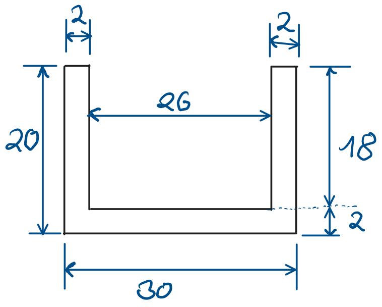
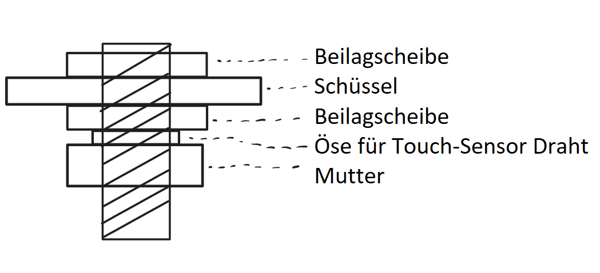
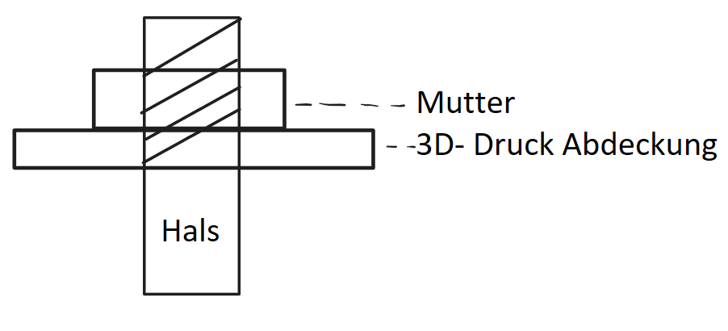
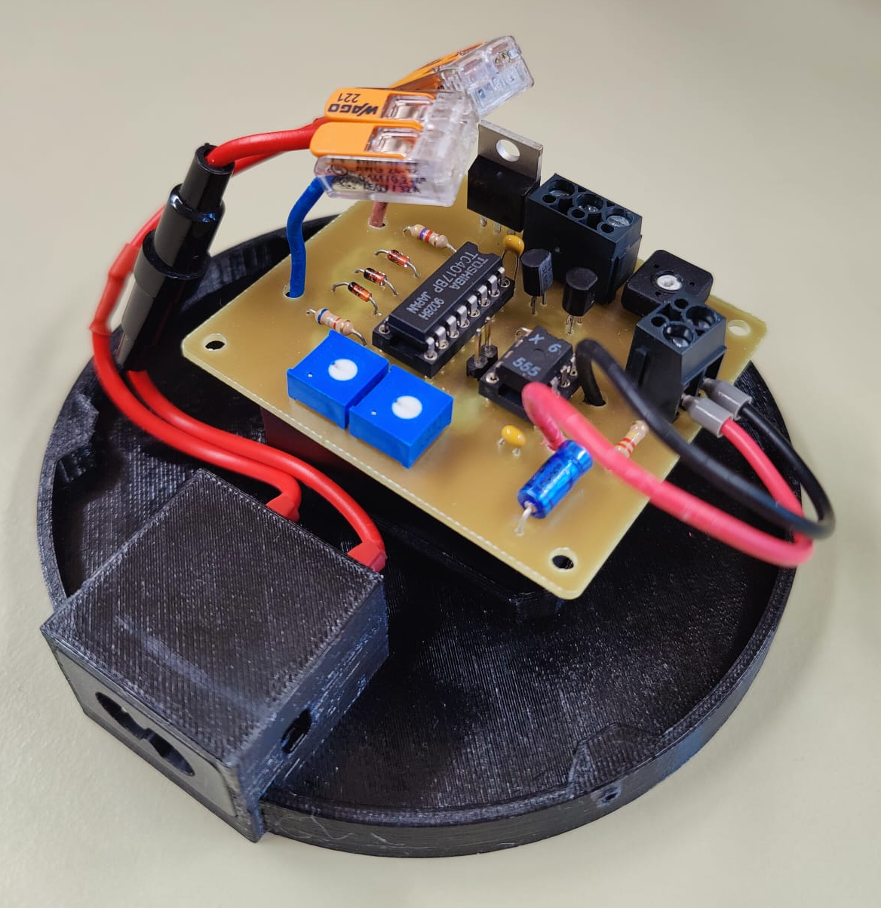
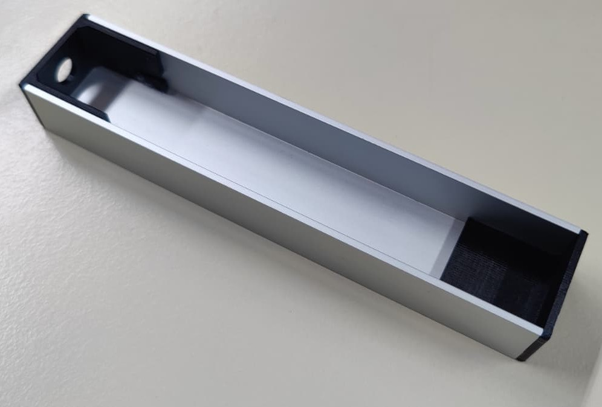
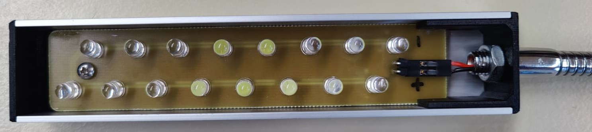

# Mechanischer Aufbau

## Bauteilliste

| Bauteil                | Link                                                                 | Stück |
|------------------------|----------------------------------------------------------------------|-------|
| Schüssel               | https://www.ikea.com/at/de/search/?q=30081467                       | 1     |
| Schwanenhals           | https://www.pollin.at/p/schwanenhals-350-mm-in-stahl-chrom-ausfuehrung-gewinde-m8x0-75-630875 | 1     |
| U-Profil               | –                                                                    | 1     |
| Bodenplatte            | [Bodenplatte](Bodenplatte_V1.2.FCStd)                                                                    | 1     |
| U-Profil Abdeckungen   | [Abdeckungen](U-Profil_Abdeckung.FCStd)                                                                    | 1     |
 

# Aufbau
## Vorbereitung
### Schüssel:

Schüssel muss noch ausgearbeitet werden.

### 3D-Druck Teile
Die 3D-Druck Teile müssen ausgetruckt werden und das Stützfilament entfernt.
Anschließend wird die Versorgungsbuchse in die Bodenplatte eingesetz.

### U-Profil
Variante1 (Quader):\
Aluminium U-Profil mit Tiefe 143mm und folgenden Abmaßen:

## Verschraubungen
### Verschraubung Schüssel-Hals

### Verschraubung Hals-Kopf

## Weiter Schritte
Die Touch-Sensorik-Leiterplatte wird auf das Netzteil gesetzt, das Netzteil anschließend auf die Bodenplatte. Die Anschlüsse erhalten eine Aderendhülse. Danach werden die Netzversorgungsdrähte des Netzteils mit den Netzanschlussdrähten verbunden. Die 5V-Ausgänge des Netzteils werden in die Versorgungsklemme der Touch-Sensorik-Leiterplatte geführt.
 
 

 
Wenn alles unter der Schüssel verstaut ist, wird die Schüssel mittels Treibschrauben mit der Bodenplatte verschraubt.
 
 
Im Kopf müssen die Abdeckungen in das U-Profil geklebt werden.
 

 
Anschließend wird die LED-Einheit-Leiterplatte eingesetzt und mit der Abdeckung verschraubt.
 
