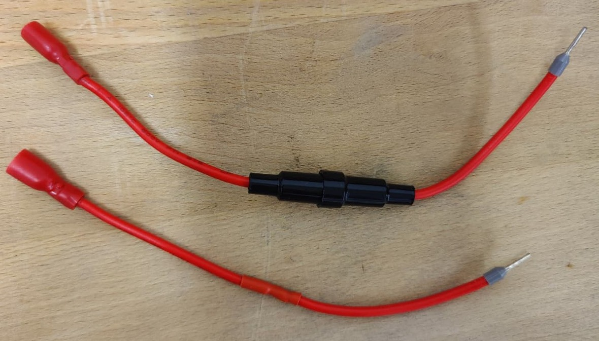
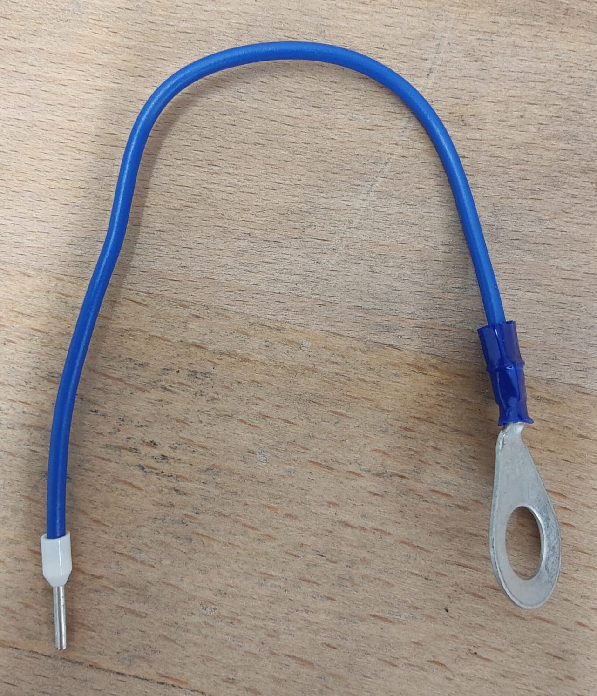

# Verdrahtung Netz zu Netzteil

Auf den inline-Sicherungshalter wird auf die eine Seite eine Adernhülse und auf die anderen Seite eine isolierte Flachsteckhülse gekrimpt. Gesamte Länge: 12cm.

Dies muss auch mit einem Draht für den anderen Anschlussfuß der Versorgungsbuchse gemacht werden. Länge insgesamt 12cm.

Dann werden die Beiden Anschlussdrähte mit einer Klemme mit dem Netzteil verbunden.
 
 

 

# Verdrahtung Touch-Sensorik zu Led-Einheit
Durch den Lampenhals wird ein zwei poliges 50 cm langes Kabel mit dem Querschnitt 0,25 mm^2 geführt. Auf die Touch-Sensorik Seite wird eine Adernhülse gekrimpt. Auf der Led-Einheit Seite ist ein zwei polige Buchse, die man auf einen Pinheader stecken kann anzubringen.
 
 

 

# Verbindung zwischen Schüssel und Touch-Sensorik
Für die Verbindung zwischen Schüssel und der Touch-Sensorik wird ein ca. 15cm langer Draht mit dem Querschnitt 0,75 mm^2 genommen. Auf die Touch-Sensorik Seite wird eine Adernhülse gekrimpt. Auf die Andere Seite kommt ein Ösen-Hülse M8 gekrimpt.
 
 

 

# Komponenten:
- Inline Sicherung: https://www.pollin.at/p/sicherungshalter-s1058-260448
- Flachsteckhülse:
- Zweipolige Buchse:
- Versorgungsbuchse:
