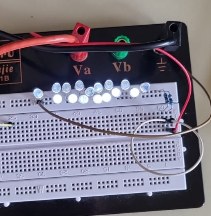

## 19.09.2025
Aluschiene eloxiert -> mit Testschaltung1 probiert ob es möglich ist, dass auf Kontakt mit Hand Spannungsänderung erfolgt \
Bestellen THT-LED: https://at.rs-online.com/web/p/leds/2545723?gb=s \

## 26.09.2025

Ansteuerung 16 LEDs parallel der bestellten LEDs, siehe LEDSerie1.00, mit 5Ohm Vorwiderstand

### LEDSerie1.00

## 03.10.2025
Schaltung mit CD4017 um verschiedene zwischen Ausgängen schalten zu können, verschiedene Stromstärken
