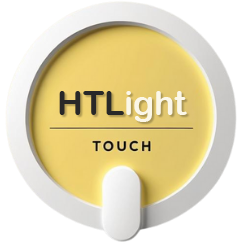
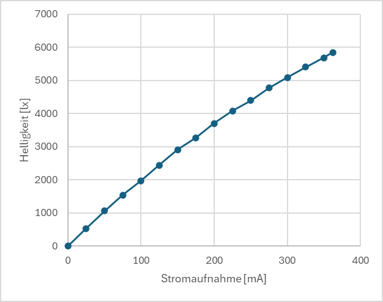

# **HTLight**
A Project made in the [HTL Steyr](https://www.htl-steyr.ac.at/) in the year 2026. 

The school was looking for a new workshop project for first-year students. As part of their engineering project, students Konstantin Schwödiauer, Thomas Zeiler, and Fabian Lenhart developed a desk lamp called **HTLight**. This lamp is not switched on using a switch, but by touching a metal part of the housing, which also allows the brightness to be adjusted.

This works via human hum voltage (Brummspannung). This means that due to water in the fingers and the creation of a small capacity, the human body always emits a small electrical impulse. This electrical impulse is detected and processed by the circuit.

This repository shows you how such a lamp can be manufacturedand which components are used. It also shows youcircuit diagrams, PCB layouts, parts lists, and prices.

Deutsch

In der Schule wurde nach einem neuen Wekstättenprojekt für die Schüler der ersten Klasse gesucht. Die Schüler Konstantin Schwödiauer, Thomas Zeiler und Fabian Lenhart haben im zuge ihres Ingenieurs Projekt eine Schreibtischlampe namens **HTlight** entwickelt. Diese Lampe wird nicht über einen Schalter, sondern durch berührung eines metalischen Gehäuseteils eingeschaltet, bzw. in die Dimmstufen geschaltet.

Dies funktioniert über die Menschliche Brummspannung. Das heißt durch Wasser in den Fingern und entstehung einer kleinen Kapazität, gibt der Menschliche Körper immer einen kleinen Stromimpuls ab. Dieser Stromimpuls wird von der Schaltung erfasst und verarbeitet.

Dieses Repository zeigt ihnen wie solche eine Lampe gefertigt werden kann, und welche Bauteile verwendet werden. Es zeigt ihnen auch Schaltpläne, Printpläne, Stücklisten und Preis 

 
 
 

 

## Fertigung

### Schritt 1: Fertigung der Touch-Sensorik Leiterplatte.

Die Verarbeitung des Touches und die Versorgung der LEDs wird mithilfe dieser Leiterplatte realisiert. Außerdem lassen sich hier auch die Dimmstufen einstellen. 
 
 
Zur Anleitung: [Touch-Sensorik](./01_Touch-Sensorik)

### Schritt 2: Fertigung der LED-Einheit Leiterplatte.
 
Stromaufnahme der LED-Einheit:

 
 

Zur Anleitung: [LED-Einheit](./02_LED-Einheit)

### Schritt 3: Fertigung der Verdrahtung.

Die Verdrahtung besteht aus folgenden Elementen:
- Versorgungsleitung von Versorgungsbuchse zu Netzteil.
- Draht von Touch-Sensorik Leiterplatte zu LED-Einheit Leiterplatte
- Draht von Touch-Sensorik Leiterplatte zu Gehäuse (Schüssel).

Zur Anleitung: [Verdrahtung](./04_Verdrahtung)

### Schritt 4: Mechanischer Aufbau.

Das Gehäuse der Lampe besteht aus:
- Bodenplatte
- Boden-Schüssel
- Schwanenhals
- Alu-U-profil
- Deckkappen U-profil
 

Zu Anleitung: [Mechanischer Aufbau](./03_Mechanischer_Aufbau)

